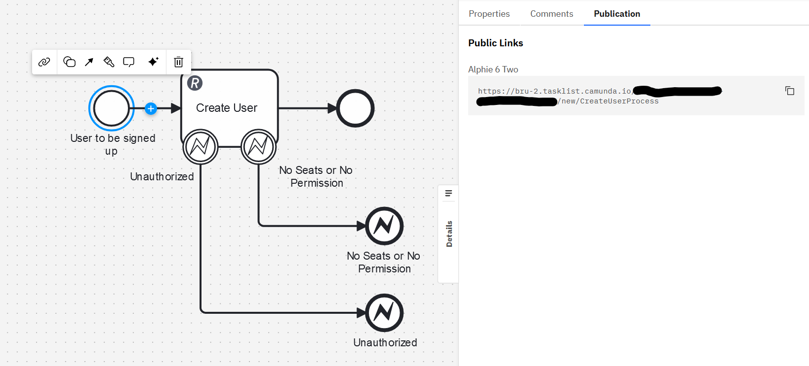
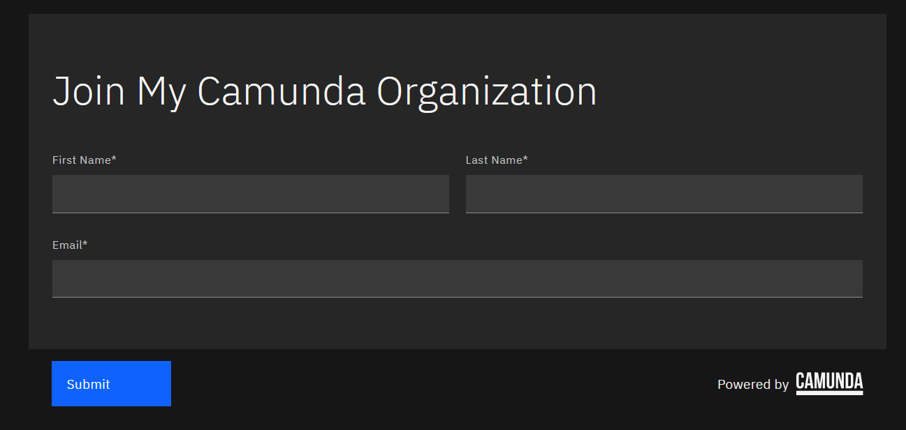
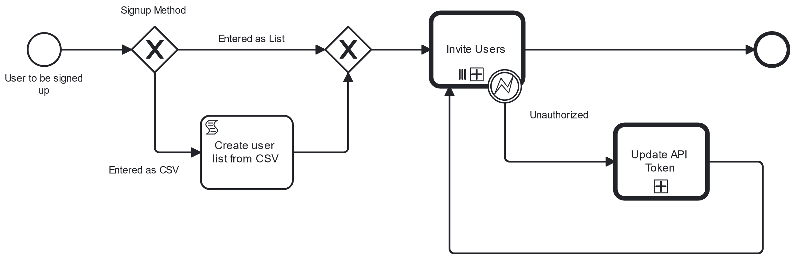
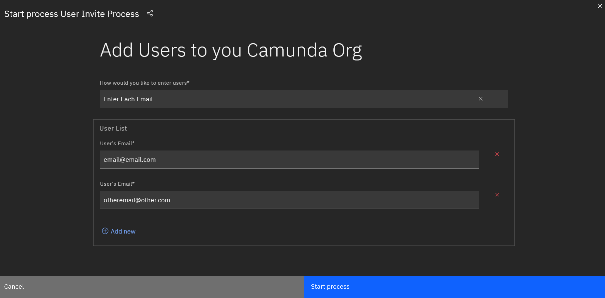
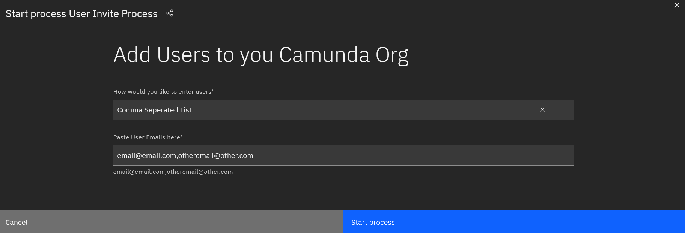

# Camunda Workshop Utility Processes
This project contains some useful processes that could make setting up a workshop with Camunda 8 SaaS much easier. 

### Add Users to Organization
At the moment adding a user to an organization is a bit of a pain since you have to do it one by one. So i've created two new methods od adding users to an organization in bulk. 

#### Install and Setup
To access the API you'll need to create some credentials you'll need a `client_id` and `client_secret` it's easy to create those - [Follow the instructions here](https://docs.camunda.io/docs/apis-tools/administration-api/authentication/#client-credentials-and-scopes)

You then need to use the `client_id` and `client_secret` to create an `access_token` (this is also detailed in the above link).

Once you have them you need to add them as[ connector secrets](https://docs.camunda.io/docs/components/console/manage-clusters/manage-secrets/) to the cluster in your organization you'll be running the processes from. 
the secrets you create need to be named as follows

`CamundaClientSecret` = `client_secret`

`CamundaClientID` = `client_id`

`CamundaAPIToken` = `access_token`

#### Give users a link which signs them up
This is very useful for a scenario where you need to get a room full of people to sign up to a single Camunda Org in order to run a workshop. But you're not sure how many people there are and you don't have their email addresses. 

This process is pretty simple, you start the process with a start form (more on that later) and you then use the Admin API to create the user. This will catch two potential error
1. Unauthorized 
   1. This will show up if your API Key is invalid
2. No Seats / No Permission
   1. This means that the API key doesn't have the permissions required to create a user
   2. It could also mean that you're full up on users

So how does this work in practice? Well the start event has as start form that is publicly accessible.

So after you've deployed the process you'll see a link in the publication tab after you select the start event.

Giving out that link will give users access to a pretty basic form that can get their details and subsequently create their account.

#### Invite all users for a given list of emails

The other scenario you might want to use is to invite a list of users to your organization in advance. This process actually calls the `Create Single User` process as a call activity

After deploying this process you'll be able to start it from tasklist - where you'll have two options.
1. You can add email addresses one by one

1. You can add a list of emails seperated by a `,`

It should look something like this `email@email.com,otheremail@other.com`

In the end it will try to create a user for each email in the list. There is also a Error Catch event which is triggered if the key you've added as a `connector secret` is no longer valid. In that case, the error is caught and new key is generated. It's then up to you to go to tasklist copy the new key and replace the old key. After that's done you can complete the task and the process will continue with the new key. 